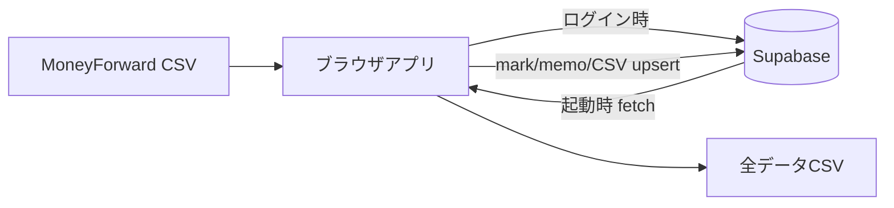

# Supabase セットアップ（家計簿ツール）

家計簿データを Supabase Postgres に保存し、スマホ・PC 間で同期するための手順です。**Supabase を設定しない場合は、従来どおり localStorage のみで動作します。**

## 前提（検討プランで決めた方針）

| 項目 | 方針 |
|---|---|
| DB 保存範囲 | **パターン B** — 明細・マーク・メモをすべて DB に保存 |
| アクセス | **単独ユーザー**（ログインした本人のみ。`households` テーブルは将来の夫婦共有用に用意） |
| 認証 | Email Magic Link（ワンタイムリンク） |
| バックアップ | **全データ CSV エクスポートは引き続き利用可能** |

## 1. Supabase プロジェクト作成

1. https://supabase.com でアカウント作成（Free プラン、クレジットカード不要）
2. **New project** → リージョン選択 → DB パスワード設定
3. プロジェクトが起動するまで待つ

## 2. スキーマ適用

**SQL Editor** を開き、[`supabase/migrations/001_initial_schema.sql`](../supabase/migrations/001_initial_schema.sql) の内容をすべて貼り付けて **Run** します。

これにより以下が作成されます：

- `households` / `household_members` / `transactions` テーブル
- 新規ユーザー登録時に household を自動作成するトリガー
- Row Level Security（RLS）— ログインユーザーは自分の household のデータのみアクセス可能

## 3. Auth 設定

1. **Authentication → Providers → Email** を有効化
2. **Confirm email** は ON 推奨（Magic Link 運用）
3. **Authentication → URL Configuration** で Site URL に GitHub Pages の URL を設定  
   例: `https://yosio44.github.io/code_sb_tsu4480/kakeibo.html`
4. **Redirect URLs** に同じ URL（および `http://localhost:1235/kakeibo.html` 開発用）を追加

## 4. API キー取得

**Project Settings → API** から以下を控えます：

- **Project URL** → `SUPABASE_URL`
- **anon public** key → `SUPABASE_ANON_KEY`

**service_role キーは絶対にフロントエンドや GitHub Secrets（ビルド注入）に使わないでください。**

## 5. ローカル開発

```bash
cp .env.example .env
# .env に SUPABASE_URL と SUPABASE_ANON_KEY を設定
npm install
npm run kakeibo
```

`.env` が空の場合は Supabase 未設定として localStorage モードで動作します。

## 6. GitHub Pages デプロイ

リポジトリ **Settings → Secrets and variables → Actions** に追加：

| Secret 名 | 値 |
|---|---|
| `SUPABASE_URL` | Project URL |
| `SUPABASE_ANON_KEY` | anon public key |

`main` に push すると GitHub Actions がビルド時に環境変数を注入します。

## 7. 7日 pause 対策（任意）

Free プランは **7日間 DB アクセスがないとプロジェクトが pause** します。週1回以上アプリを使えば問題ありません。自動化する場合は [`.github/workflows/supabase-keepalive.yml`](../.github/workflows/supabase-keepalive.yml) が週1 ping を送ります（Secrets 設定後に有効）。

## プライバシー上の注意

Supabase 設定後は、家計データ（店名・金額・金融機関名・メモ）が **Supabase クラウド（Postgres）に保存**されます。GitHub Pages の URL は公開ですが、**ログイン + RLS** により他人があなたのデータを読むことはできません（anon key だけでは全データにはアクセス不可）。

オフライン専用・クラウド非送信を維持したい場合は `.env` / GitHub Secrets を設定せず、従来の localStorage モードを使い続けてください。

## データの流れ



- **初回**: CSV インポート → DB に upsert
- **2回目以降（ログイン済み）**: DB から自動ロード（CSV 不要）
- **新しい月**: CSV を追加インポート → DB に upsert（ID で重複排除）
- **バックアップ**: 「全データCSVをダウンロード」でいつでもエクスポート可能
